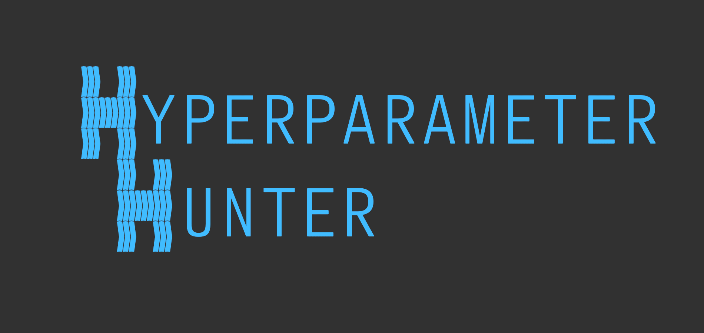

HyperparameterHunter
====================



[](https://travis-ci.org/HunterMcGushion/hyperparameter_hunter)
[](https://hyperparameter-hunter.readthedocs.io/en/stable/?badge=stable)
[](https://coveralls.io/github/HunterMcGushion/hyperparameter_hunter?branch=master&service=github)
[](https://codecov.io/gh/HunterMcGushion/hyperparameter_hunter)
[](https://codeclimate.com/github/HunterMcGushion/hyperparameter_hunter/maintainability)
[](https://www.codacy.com/app/HunterMcGushion/hyperparameter_hunter?utm_source=github.com&amp;utm_medium=referral&amp;utm_content=HunterMcGushion/hyperparameter_hunter&amp;utm_campaign=Badge_Grade)

[](https://badge.fury.io/py/hyperparameter-hunter)
[](https://pepy.tech/project/hyperparameter-hunter)
[](https://www.paypal.com/cgi-bin/webscr?cmd=_s-xclick&hosted_button_id=Q3EX3PQUV256G)
[](https://github.com/ambv/black)

Automatically save and learn from Experiment results, leading to long-term, persistent optimization that remembers all your tests.

HyperparameterHunter provides a wrapper for machine learning algorithms that saves all the important data. Simplify the experimentation and hyperparameter tuning process by letting HyperparameterHunter do the hard work
of recording, organizing, and learning from your tests — all while using the same libraries you already do. Don't let any of your experiments go to waste, and start doing hyperparameter optimization the way it was meant to be.

* **Installation:** `pip install hyperparameter-hunter`
* **Source:** https://github.com/HunterMcGushion/hyperparameter_hunter
* **Documentation:** [https://hyperparameter-hunter.readthedocs.io](https://hyperparameter-hunter.readthedocs.io/en/latest/index.html)

Features
--------
* Automatically record Experiment results
* Truly informed hyperparameter optimization that automatically uses past Experiments
* Eliminate boilerplate code for cross-validation loops, predicting, and scoring
* Stop worrying about keeping track of hyperparameters, scores, or re-running the same Experiments
* Use the libraries and utilities you already love

How to Use HyperparameterHunter
-------------------------------
Don’t think of HyperparameterHunter as another optimization library that you bring out only when its time to do hyperparameter optimization. Of course, it does optimization, but its better to view HyperparameterHunter as your own personal machine learning toolbox/assistant.

The idea is to start using HyperparameterHunter immediately. Run all of your benchmark/one-off experiments through it. 

The more you use HyperparameterHunter, the better your results will be. If you just use it for optimization, sure, it’ll do what you want, but that’s missing the point of HyperparameterHunter.

If you’ve been using it for experimentation and optimization along the entire course of your project, then when you decide to do hyperparameter optimization, HyperparameterHunter is already aware of all that you’ve done, and that’s when HyperparameterHunter does something remarkable. It doesn’t start optimization from scratch like other libraries. It starts from all of the Experiments and previous optimization rounds you’ve already run through it.

Getting Started
---------------

### 1) Environment:

Set up an Environment to organize Experiments and Optimization results.
<br>
Any Experiments or Optimization rounds we perform will use our active Environment.

```python
from hyperparameter_hunter import Environment, CVExperiment
import pandas as pd
from sklearn.datasets import load_breast_cancer
from sklearn.model_selection import StratifiedKFold

data = load_breast_cancer()
df = pd.DataFrame(data=data.data, columns=data.feature_names)
df['target'] = data.target

env = Environment(
    train_dataset=df,  # Add holdout/test dataframes, too
    results_path='path/to/results/directory',  # Where your result files will go
    metrics=['roc_auc_score'],  # Callables, or strings referring to `sklearn.metrics`
    cv_type=StratifiedKFold,  # Class, or string in `sklearn.model_selection`
    cv_params=dict(n_splits=5, shuffle=True, random_state=32)
)
```

### 2) Individual Experimentation:

Perform Experiments with your favorite libraries simply by providing model initializers and hyperparameters
<!-- Keras -->

<details>
<summary>Keras</summary>

```python
# Same format used by `keras.wrappers.scikit_learn`. Nothing new to learn
def build_fn(input_shape):  # `input_shape` calculated for you
    model = Sequential([
        Dense(100, kernel_initializer='uniform', input_shape=input_shape, activation='relu'),
        Dropout(0.5),
        Dense(1, kernel_initializer='uniform', activation='sigmoid')
    ])  # All layer arguments saved (whether explicit or Keras default) for future use
    model.compile(optimizer='adam', loss='binary_crossentropy', metrics=['accuracy'])
    return model

experiment = CVExperiment(
    model_initializer=KerasClassifier,
    model_init_params=build_fn,  # We interpret your build_fn to save hyperparameters in a useful, readable format
    model_extra_params=dict(
        callbacks=[ReduceLROnPlateau(patience=5)],  # Use Keras callbacks
        batch_size=32, epochs=10, verbose=0  # Fit/predict arguments
    )
)
```

</details>

<!-- SKLearn -->
<details>
<summary>SKLearn</summary>

```python
experiment = CVExperiment(
    model_initializer=LinearSVC,  # (Or any of the dozens of other SK-Learn algorithms)
    model_init_params=dict(penalty='l1', C=0.9)  # Default values used and recorded for kwargs not given
)
```
</details>
<!-- XGBoost -->
<details open>
<summary>XGBoost</summary>

```python
experiment = CVExperiment(
    model_initializer=XGBClassifier,
    model_init_params=dict(objective='reg:linear', max_depth=3, n_estimators=100, subsample=0.5)
)
```
</details>
<!-- LightGBM -->
<details>
<summary>LightGBM</summary>

```python
experiment = CVExperiment(
    model_initializer=LGBMClassifier,
    model_init_params=dict(boosting_type='gbdt', num_leaves=31, max_depth=-1, min_child_samples=5, subsample=0.5)
)
```
</details>
<!-- CatBoost -->
<details>
<summary>CatBoost</summary>

```python
experiment = CVExperiment(
    model_initializer=CatboostClassifier,
    model_init_params=dict(iterations=500, learning_rate=0.01, depth=7, allow_writing_files=False),
    model_extra_params=dict(fit=dict(verbose=True))  # Send kwargs to `fit` and other extra methods
)
```
</details>
<!-- RGF -->
<details>
<summary>RGF</summary>

```python
experiment = CVExperiment(
    model_initializer=RGFClassifier,
    model_init_params=dict(max_leaf=1000, algorithm='RGF', min_samples_leaf=10)
)
```
</details>

### 3) Hyperparameter Optimization:

Just like Experiments, but if you want to optimize a hyperparameter, use the classes imported below

```python
from hyperparameter_hunter import Real, Integer, Categorical
from hyperparameter_hunter import optimization as opt
```

<!-- Keras -->
<details>
<summary>Keras</summary>

```python
def build_fn(input_shape):
    model = Sequential([
        Dense(Integer(50, 150), input_shape=input_shape, activation='relu'),
        Dropout(Real(0.2, 0.7)),
        Dense(1, activation=Categorical(['sigmoid', 'softmax']))
    ])
    model.compile(
        optimizer=Categorical(['adam', 'rmsprop', 'sgd', 'adadelta']),
        loss='binary_crossentropy', metrics=['accuracy']
    )
    return model

optimizer = opt.RandomForestOptPro(iterations=7)
optimizer.forge_experiment(
    model_initializer=KerasClassifier,
    model_init_params=build_fn,
    model_extra_params=dict(
        callbacks=[ReduceLROnPlateau(patience=Integer(5, 10))],
        batch_size=Categorical([32, 64]),
        epochs=10, verbose=0
    )
)
optimizer.go()
```
</details>

<!-- SKLearn -->
<details>
<summary>SKLearn</summary>

```python
optimizer = opt.DummyOptPro(iterations=42)
optimizer.forge_experiment(
    model_initializer=AdaBoostClassifier,  # (Or any of the dozens of other SKLearn algorithms)
    model_init_params=dict(
        n_estimators=Integer(75, 150),
        learning_rate=Real(0.8, 1.3),
        algorithm='SAMME.R'
    )
)
optimizer.go()
```
</details>
<!-- XGBoost -->
<details open>
<summary>XGBoost</summary>

```python
optimizer = opt.BayesianOptPro(iterations=10)
optimizer.forge_experiment(
    model_initializer=XGBClassifier,
    model_init_params=dict(
        max_depth=Integer(low=2, high=20),
        learning_rate=Real(0.0001, 0.5),
        n_estimators=200,
        subsample=0.5,
        booster=Categorical(['gbtree', 'gblinear', 'dart']),
    )
)
optimizer.go()
```
</details>
<!-- LightGBM -->
<details>
<summary>LightGBM</summary>

```python
optimizer = opt.BayesianOptPro(iterations=100)
optimizer.forge_experiment(
    model_initializer=LGBMClassifier,
    model_init_params=dict(
        boosting_type=Categorical(['gbdt', 'dart']),
        num_leaves=Integer(5, 20),
        max_depth=-1,
        min_child_samples=5,
        subsample=0.5
    )
)
optimizer.go()
```
</details>
<!-- CatBoost -->
<details>
<summary>CatBoost</summary>

```python
optimizer = opt.GradientBoostedRegressionTreeOptPro(iterations=32)
optimizer.forge_experiment(
    model_initializer=CatBoostClassifier,
    model_init_params=dict(
        iterations=100,
        eval_metric=Categorical(['Logloss', 'Accuracy', 'AUC']),
        learning_rate=Real(low=0.0001, high=0.5),
        depth=Integer(4, 7),
        allow_writing_files=False
    )
)
optimizer.go()
```
</details>
<!-- RGF -->
<details>
<summary>RGF</summary>

```python
optimizer = opt.ExtraTreesOptPro(iterations=10)
optimizer.forge_experiment(
    model_initializer=RGFClassifier,
    model_init_params=dict(
        max_leaf=1000,
        algorithm=Categorical(['RGF', 'RGF_Opt', 'RGF_Sib']),
        l2=Real(0.01, 0.3),
        normalize=Categorical([True, False]),
        learning_rate=Real(0.3, 0.7),
        loss=Categorical(['LS', 'Expo', 'Log', 'Abs'])
    )
)
optimizer.go()
```
</details>

Output File Structure
---------------------
This is a simple illustration of the file structure you can expect your `Experiment`s to generate. For an in-depth description of the directory structure and the contents of the various files, see the [File Structure Overview](https://hyperparameter-hunter.readthedocs.io/en/latest/file_structure_overview.html) section in the documentation. However, the essentials are as follows:

1. An `Experiment` adds a file to each *HyperparameterHunterAssets/Experiments* subdirectory, named by `experiment_id`
2. Each `Experiment` also adds an entry to *HyperparameterHunterAssets/Leaderboards/GlobalLeaderboard.csv*
3. Customize which files are created via `Environment`'s `file_blacklist` and `do_full_save` kwargs (documented [here](https://hyperparameter-hunter.readthedocs.io/en/latest/api_essentials.html#environment))

```
HyperparameterHunterAssets
|   Heartbeat.log
|
└───Experiments
|   |
|   └───Descriptions
|   |   |   <Files describing Experiment results, conditions, etc.>.json
|   |
|   └───Predictions<OOF/Holdout/Test>
|   |   |   <Files containing Experiment predictions for the indicated dataset>.csv
|   |
|   └───Heartbeats
|   |   |   <Files containing the log produced by the Experiment>.log
|   |
|   └───ScriptBackups
|       |   <Files containing a copy of the script that created the Experiment>.py
|
└───Leaderboards
|   |   GlobalLeaderboard.csv
|   |   <Other leaderboards>.csv
|
└───TestedKeys
|   |   <Files named by Environment key, containing hyperparameter keys>.json
|
└───KeyAttributeLookup
    |   <Files linking complex objects used in Experiments to their hashes>
```

Installation
------------

```
pip install hyperparameter-hunter
```

If you like being on the cutting-edge, and you want all the latest developments, run:

```
pip install git+https://github.com/HunterMcGushion/hyperparameter_hunter.git
```

If you want to contribute to HyperparameterHunter, [get started here](CONTRIBUTING.md).

I Still Don't Get It
--------------------
That's ok. Don't feel bad. It's a bit weird to wrap your head around. Here's an example that illustrates how everything is related:

```python
from hyperparameter_hunter import Environment, CVExperiment, BayesianOptPro, Integer
from hyperparameter_hunter.utils.learning_utils import get_breast_cancer_data
from xgboost import XGBClassifier

# Start by creating an `Environment` - This is where you define how Experiments (and optimization) will be conducted
env = Environment(
    train_dataset=get_breast_cancer_data(target='target'),
    results_path='HyperparameterHunterAssets',
    metrics=['roc_auc_score'],
    cv_type='StratifiedKFold',
    cv_params=dict(n_splits=10, shuffle=True, random_state=32),
)

# Now, conduct an `Experiment`
# This tells HyperparameterHunter to use the settings in the active `Environment` to train a model with these hyperparameters
experiment = CVExperiment(
    model_initializer=XGBClassifier,
    model_init_params=dict(
        objective='reg:linear',
        max_depth=3
    )
)

# That's it. No annoying boilerplate code to fit models and record results
# Now, the `Environment`'s `results_path` directory will contain new files describing the Experiment just conducted

# Time for the fun part. We'll set up some hyperparameter optimization by first defining the `OptPro` (Optimization Protocol) we want
optimizer = BayesianOptPro(verbose=1)

# Now we're going to say which hyperparameters we want to optimize.
# Notice how this looks just like our `experiment` above
optimizer.forge_experiment(
    model_initializer=XGBClassifier,
    model_init_params=dict(
        objective='reg:linear',  # We're setting this as a constant guideline - Not one to optimize
        max_depth=Integer(2, 10)  # Instead of using an int like the `experiment` above, we provide a space to search
    )
)
# Notice that our range for `max_depth` includes the `max_depth=3` value we used in our `experiment` earlier

optimizer.go()  # Now, we go

assert experiment.experiment_id in [_[2] for _ in optimizer.similar_experiments]
# Here we're verifying that the `experiment` we conducted first was found by `optimizer` and used as learning material
# You can also see via the console that we found `experiment`'s saved files, and used it to start optimization

last_experiment_id = optimizer.current_experiment.experiment_id
# Let's save the id of the experiment that was just conducted by `optimizer`

optimizer.go()  # Now, we'll start up `optimizer` again...

# And we can see that this second optimization round learned from both our first `experiment` and our first optimization round
assert experiment.experiment_id in [_[2] for _ in optimizer.similar_experiments]
assert last_experiment_id in [_[2] for _ in optimizer.similar_experiments]
# It even did all this without us having to tell it what experiments to learn from

# Now think about how much better your hyperparameter optimization will be when it learns from:
# - All your past experiments, and
# - All your past optimization rounds
# And the best part: HyperparameterHunter figures out which experiments are compatible all on its own
# You don't have to worry about telling it that KFold=5 is different from KFold=10,
# Or that max_depth=12 is outside of max_depth=Integer(2, 10)
```

Tested Libraries
----------------
* [Keras](https://github.com/HunterMcGushion/hyperparameter_hunter/blob/master/examples/lib_keras_example.py)
* [scikit-learn](https://github.com/HunterMcGushion/hyperparameter_hunter/blob/master/examples/lib_sklearn_example.py)
* [LightGBM](https://github.com/HunterMcGushion/hyperparameter_hunter/blob/master/examples/lib_lightgbm_example.py)
* [CatBoost](https://github.com/HunterMcGushion/hyperparameter_hunter/blob/master/examples/lib_catboost_example.py)
* [XGBoost](https://github.com/HunterMcGushion/hyperparameter_hunter/blob/master/examples/simple_experiment_example.py)
* [rgf_python](https://github.com/HunterMcGushion/hyperparameter_hunter/blob/master/examples/lib_rgf_example.py)
* ... More on the way

Gotchas/FAQs
------------
These are some things that might "getcha"

### General:
- **Can't provide initial search points to `OptPro`?**
   - This is intentional. If you want your optimization rounds to start with specific search points (that you haven't recorded yet), simply perform a `CVExperiment` before initializing your `OptPro`
   - Assuming the two have the same guideline hyperparameters and the `Experiment` fits within the search space defined by your `OptPro`, the optimizer will locate and read in the results of the `Experiment`
   - Keep in mind, you'll probably want to remove the `Experiment` after you've done it once, as the results have been saved. Leaving it there will just execute the same `Experiment` over and over again
- **After changing things in my "HyperparameterHunterAssets" directory, everything stopped working**
   - Yeah, don't do that. Especially not with "Descriptions", "Leaderboards", or "TestedKeys"
   - HyperparameterHunter figures out what's going on by reading these files directly. 
   - Removing them, or changing their contents can break a lot of HyperparameterHunter's functionality

### Keras:
- **Can't find similar Experiments with simple Dense/Activation neural networks?**
   - This is likely caused by switching between using a separate `Activation` layer, and providing a `Dense` layer with the `activation` kwarg
   - Each layer is treated as its own little set of hyperparameters (as well as being a hyperparameter, itself), which means that as far as HyperparameterHunter is concerned, the following two examples are NOT equivalent:
      - ```Dense(10, activation=‘sigmoid’)```
      - ```Dense(10); Activation(‘sigmoid’)```
   - We’re working on this, but for now, the workaround is just to be consistent with how you add activations to your models
      - Either use separate `Activation` layers, or provide `activation` kwargs to other layers, and stick with it!
- **Can't optimize the `model.compile` arguments: `optimizer` and `optimizer_params` at the same time?**
   - This happens because Keras’ `optimizers` expect different arguments
   - For example, when `optimizer=Categorical(['adam', 'rmsprop'])`, there are two different possible dicts of `optimizer_params`
   - For now, you can only optimize `optimizer`, and `optimizer_params` separately
   - A good way to do this might be to select a few optimizers you want to test, and don’t provide an `optimizer_params` value. That way, each `optimizer` will use its default parameters
      - Then you can select which `optimizer` was the best, and set `optimizer=<best optimizer>`, then move on to tuning `optimizer_params`, with arguments specific to the `optimizer` you selected

### CatBoost:
- **Can't find similar Experiments for CatBoost?**
   - This may be happening because the default values for the kwargs expected in CatBoost’s model `__init__` methods are defined somewhere else, and given placeholder values of `None` in their signatures
   - Because of this, HyperparameterHunter assumes that the default value for an argument really is `None` if you don’t explicitly provide a value for that argument
   - This is obviously not the case, but I just can’t seem to figure out where the actual default values used by CatBoost are located, so if anyone knows how to remedy this situation, I would love your help!


